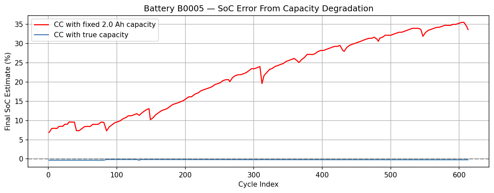
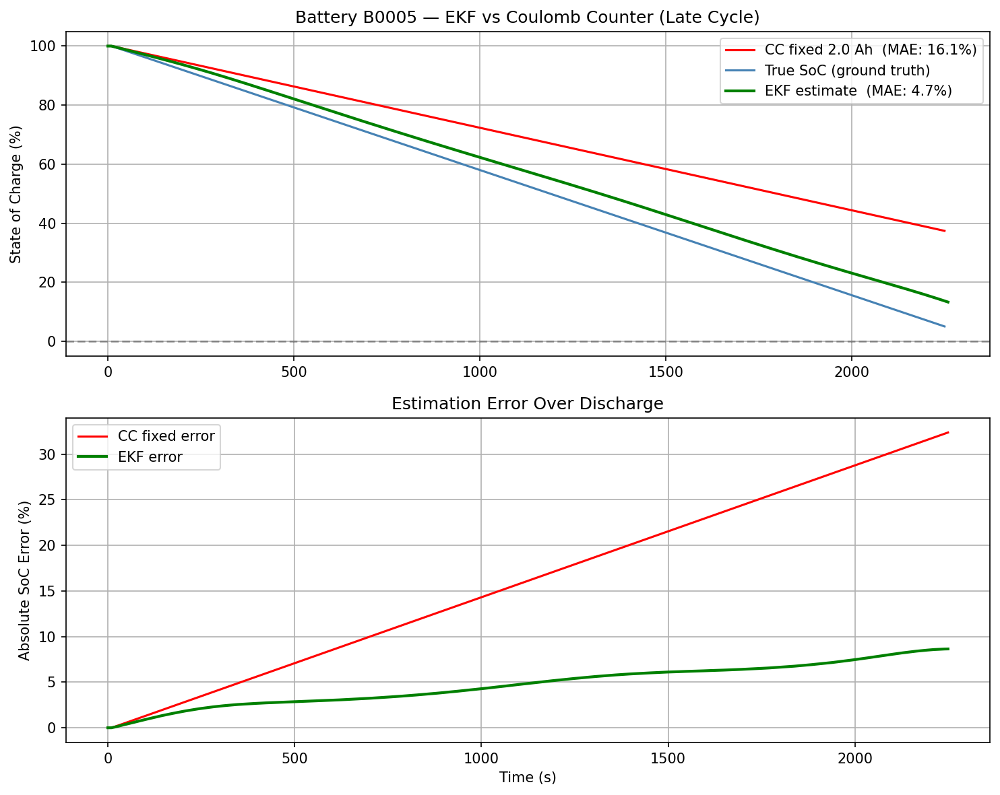
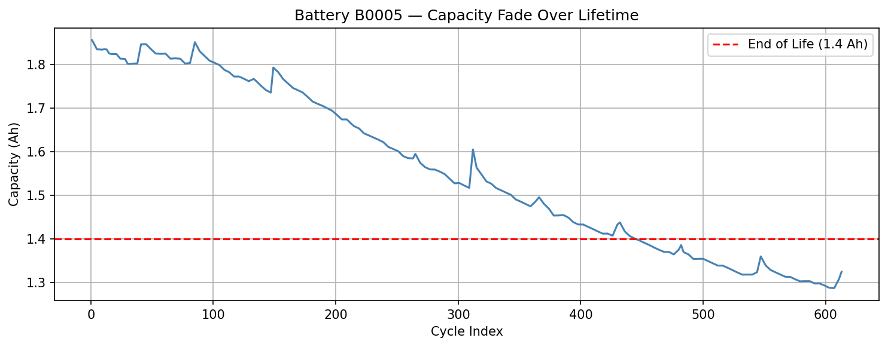

# Battery State-of-Charge Estimation using Extended Kalman Filter

Real-time battery SoC estimator built with an EKF, validated on the NASA Li-Ion Battery Aging Dataset. Reduces mean absolute error by **70.6%** compared to naive Coulomb counting on a heavily degraded battery.

For full methodology and results, see the [technical report](report/soc_estimation_report.pdf).

## The Problem

Batteries don't have a fuel gauge. The standard approach — integrating current over time (Coulomb counting) — accumulates up to **35% SoC error** over a battery's lifetime because it assumes a fixed capacity that degrades with age.

## The Solution

A rolling capacity estimator tracks true battery capacity across cycles. An EKF uses this estimate for real-time SoC tracking, fusing current integration with voltage measurements.

| Method | MAE |
|--------|-----|
| Coulomb counter (fixed 2.0 Ah) | 16.1% |
| EKF with rolling capacity estimate | 4.7% |

## Key Findings

- Capacity degrades from 1.85 Ah → 1.32 Ah over 600+ cycles
- Internal resistance increases from 0.095 Ω → 0.112 Ω over lifetime
- OCV curve is flat between 20–80% SoC, making voltage weakly informative in that range
- Capacity estimation requires multiple cycles to converge — a known observability limitation

## How to Run

1. Download [B0005.mat](https://www.nasa.gov/intelligent-systems-division/discovery-and-systems-health/pcoe/pcoe-data-set-repository/) from the NASA PCoE dataset
2. Open `battery_ekf.ipynb` in Google Colab
3. Upload `B0005.mat` when prompted
4. Run all cells

## Future Work

- Dual EKF for robust online capacity estimation
- Thermal model coupling heat generation to internal resistance
- Validation across all four batteries (B0005, B0006, B0007, B0018)
- Hardware validation on a physical 18650 test rig

## Dataset

NASA PCoE Li-Ion Battery Aging Dataset — 168 discharge cycles, end-of-life at 30% capacity fade (2.0 Ah → 1.4 Ah).
